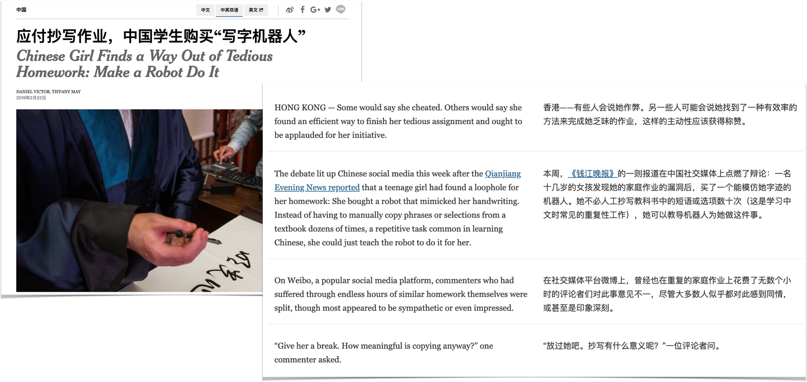

I grew up as a child in Hong Kong before I moved to North America with my family in my teens. Hong Kong is a vibrant dynamic city, and one of the greatest gifts as a child in Hong Kong was exposure to both East and Western culture. I was fortunate enough to spend years reading and writing Chinese as a result, and can still read Chinese even though now I live in the US. As I was learning more about natural language processing, I can't help but wonder: how would I apply these techniques to Chinese?

## Goals
I don't have a particular end result I was looking for, but what I do want to understand is how Chinese parsing works when each Chinese character usually needs to get combined with other characters before it forms "meaning", similar to an English word. For example, see the following English sentence in Chinese:
<p align="center">
  
</p>

So I decided to just try to do a topic modeling exercise on a news article in both English and Chinese just to see what sort of results I would get from the exercise.

## Data Source
I picked a [New York Times article](https://www.nytimes.com/2019/02/21/world/asia/china-handwriting-robot.html) to try out processing Chinese, because New York Times offers a Chinese edition too (which is really awesome). I picked this article about a Chinese girl using robot to help her cheat. Somewhat related to machine learning, right?

<p align="center">
  
</p>

## Tools Used
Python was used. I used scikit-learn for topic modeling, but picked [Stanford's CoreNLP toolkit](https://stanfordnlp.github.io/CoreNLP/) for tokenizing/segmenting Chinese. Some basic information I found about the CoreNLP library:
* Support for multiple languages (English, Arabic, Chinese, French, German, and Spanish)
* Available APIs for major programming languages (e.g. R, Ruby, Scala, Java, Python…etc)
* Requires Java 1.8+
* NTLK supports interface with the web service in Python
* Run as a web service. For example, to start a service specifically for parsing Chinese:

```console
java -Xmx4g -cp "*" edu.stanford.nlp.pipeline.StanfordCoreNLPServer -serverProperties StanfordCoreNLP-chinese.properties -preload tokenize,ssplit,pos,lemma,ner,parse -status_port 9001  -port 9001 -timeout 15000
```

## Methodology Used
* I started with the usual pre-processing steps: removing stop words, punctuations. I found a list of Chinese stopwords from [Stopwords ISO](https://github.com/stopwords-iso/stopwords-zh/blob/master/stopwords-zh.txt).

* I then used CoreNLP's Tokenizer to tokenize Chinese text. Hey, it works similar to tokenizing English! When you run a tokenizer to separate out "words", in Chinese's case a sequence of characters gets "tokenized"/segmented. Here's a tokenization example:

> Original Text: '应付抄写作业，中国学生购买“写字机器人'

> After Tokenization: '应付', '抄写', '作业', '中国', '学生', '购买', '写字', '机器人'


* Topic modeling technique (TFIDF word vector with non-negative matrix factorization) is then used to tease out groups of words that often appear with each other in a paragraph. Here are two sample topics resulted out of 10 topics:

> *Sample topic 1 from Chinese text:* 大多数, 同情, 深刻, 曾经, 不一, 无数, 重复, 印象, 意见, 似乎

> *Sample topic 1 from English text:* suffered, appeared, sympathetic, hours, split, commenters, platform, popular, impressed, similar

> *Sample topic 2 from Chinese text:* 区别, 小姑娘, 制造, 动物, 人和, 评论, 步, 已经, 工具, 第一

> *Sample topic 2 from English text:* young, animals, reasoned, difference, humans, knows, lady, tools, know, make


## Conclusions
Stanford CoreNLP is a natural language toolkit that supports parsing Chinese, and it was relatively easy to set up and get it running. NLP steps I learned to use on English such as tokenizing, removing stopwords and punctuations are same for Chinese. When reading about how Chinese word tokenization/segmentation works, I learned that different NLP applications have different needs for segmentation/tokenization, and so the methods may need to be optimized differently depending on usage [5]. There is more to learn there but that will be an investigation for another time.

## Resources
1. Stanford CoreNLP: Introduction [(link)](http://www.sfs.uni-tuebingen.de/~keberle/NLPTools/presentations/CoreNLP/CoreNLP_introduction.pdf).
2. Stanford CoreNLP API in NLTK [(link)](https://github.com/nltk/nltk/wiki/Stanford-CoreNLP-API-in-NLTK).
3. All languages stopwords collection [(link)](https://github.com/stopwords-iso/stopwords-zh/blob/master/stopwords-zh.txt).
4. Using Regular Expression to Filter Chinese [(link)](https://chenyuzuoo.github.io/posts/28001/).
5. Optimizing Chinese Word Segmentation for Machine Translation Performance [(link)](https://nlp.stanford.edu/pubs/acl-wmt08-cws.pdf).
